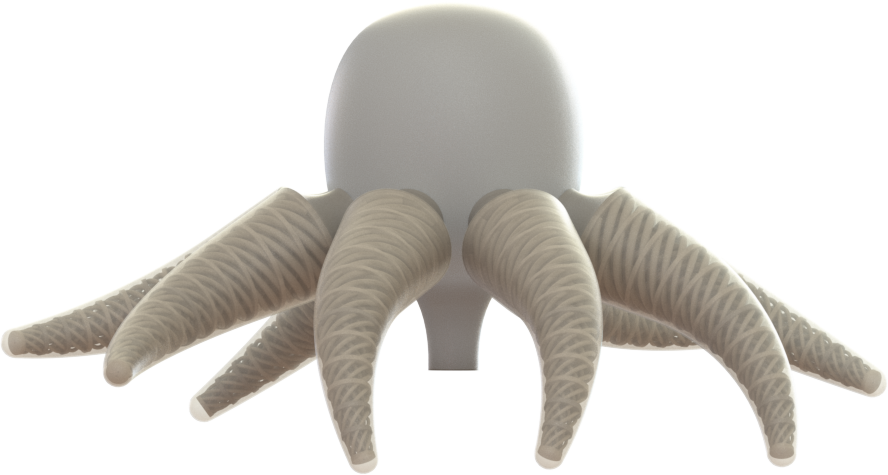
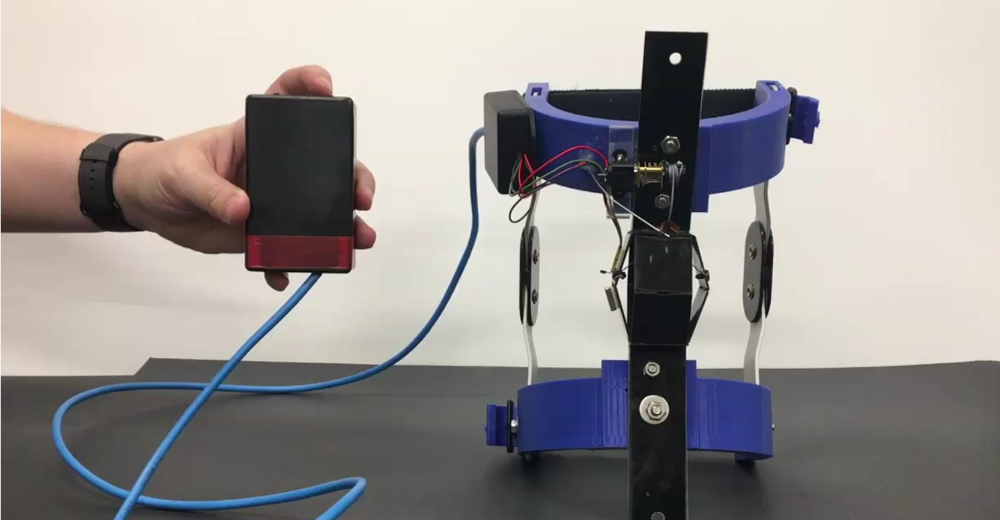
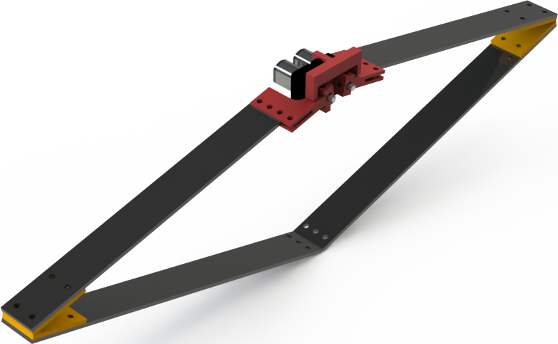
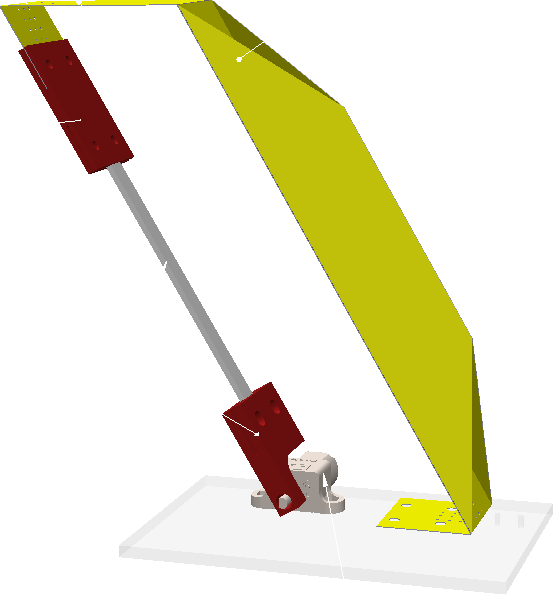
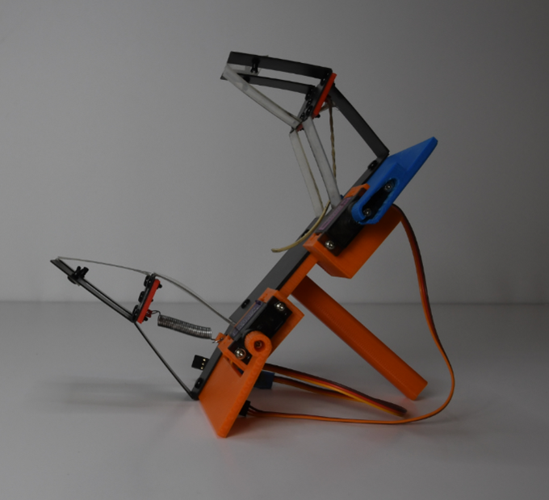

# Soft Octopus-inspired Hydrogel
_Roozbeh Khodambashi_

{:width="50%"}

We are working to create a framework for design, rapid prototyping and control of robust, energy-efficient, autonomous soft arms with octopus-inspired distributed neuromuscular sensing and actuation. The arms will be capable of continuous deformation through the use of hydrogel "muscles" and distributed sensing through the use of embedded silver "neuron" interconnections. Such a unique octopus-inspired design forms a built-in local "sensing-actuation" feedback loop to achieve adaptive reconfiguration in response to the local environment. Such local adaptation will enable the robot to perform high-level tasks such as locomotion and reversible adhesion without coordination from a central controller in a highly accurate, rapid, and energy-efficient way. This study will also produce fundamental principles and theory for the modeling and control of soft robots in a way which leverages their unique capabilities and is inspired by how cephalopod appendages interact with their environment.


# Lockable "Exo-Shell" Knee Brace
_Roozbeh Khodambashi_

{: width="50%"}

Prolonged sitting in the wrong posture could result in chronic pain, fatigue and injury in the knee. This problem is most common in assembly line workers and office employees.  We have developed a knee assist device which helps relieve the pressure on the knee and thus prevents injuries. Our device is made through laminate manufacturing techniques using cheaper materials. Therefore, the final cost and the production time are much lower compared to similar devices.


# Design of a Cutting Tool for Clearing Underwater Vegetation

_Sheena Benson_

The objective of this research is to further the development of the bio-inspired fish being and constructed by Dr. Aukes and his team of student researchers by designing an inexpensive, reliable, and effective cutting tool to be used in conjunction with the robotic fish to cut and reduce the number of underwater vegetation growing in canals and waterways here in Phoenix. Such a device would reduce the cost and manpower currently used to clear those canals. Without clearing aquatic plants from the canals, certain parts of the city would also become vulnerable to increased flooding in the event of a sudden downpour, leading to possible infrastructure damage.

# Buoyancy Control of a Bio-inspired Robotic Fish

_Alia Gilbert_

This project focuses on controlling the altitude of an underwater robot meant to do environmental cleanup of vegetation in a canal. A bladder modeled off fish anatomy will be designed containing two bulbs, likely of laminate material, with a tube containing a pump. The pump will transfer air between the two bulbs to control the direction of the buoyancy in the robot. The shift in buoyancy will allow the body of the robot to move either up or down. Using this laminate material in prototyping for underwater robotics allows for low cost testing and quick turnaround time for iterations. We will be checking consistency of the level that the robot is driving using an IMU to control the amount of water or air in the bulbs of the systems.

# Design of a Hopping Platform using Laminate Construction

_Jacob Knaup_

{: width="50%"}

Taking advantage of laminate materials' flexibility, a high-performance jumping platform is developed. A physical prototype and accurate model of the design are sought in tandem with each being used to inform the other. This will result in a leg design to be incorporated into future jumping or hopping robots and a validated simulation that can be used to design future robots using the same methods.

# Low-Cost, Modular Force Control Solution

_Jacob Knaup_

{:width="50%"}

Force control offers numerous benefits to robots over other control schemes such as more natural movements and increased sensitivity to the surrounding environment, but it is typically only available to high-end robots. This research aims to develop a modular force control solution for low-cost robots. The solution is designed to be easy to incorporate into future laminate robots, allowing the designer to add force control capabilities, while placing minimal constraints on the design.

# Underactuated Laminate gripper with Low-Cost Sensing.

_Drew Carlson_

{:width="50%"}

This project explores the design and development of a robotic gripper using low cost materials. It uses a four-bar mechanism to grasp objects. The system is back driven until the finger makes contact with an object. The servo continues to drive over coming the force of a spring holding the gripper in a open position providing the method of under-actuation.  

The laminate design allows for multiple materials to be used. This can be exploited to make the contact points more flexible for the inclusion of flex sensors. By using multiple low cost flex sensors the location, number, and amount of force being applied in the grip can be determined using beam theory as a model.
